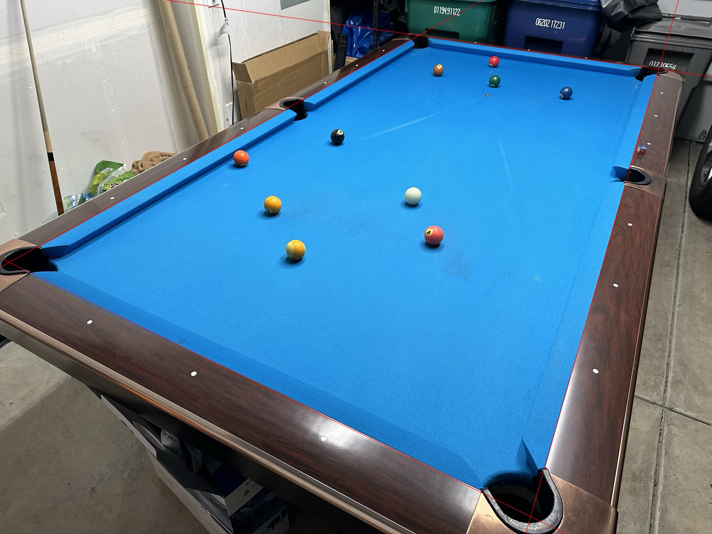
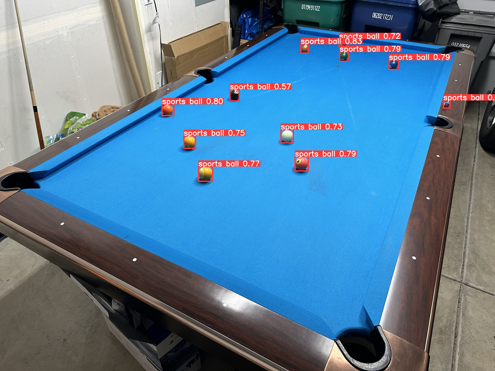
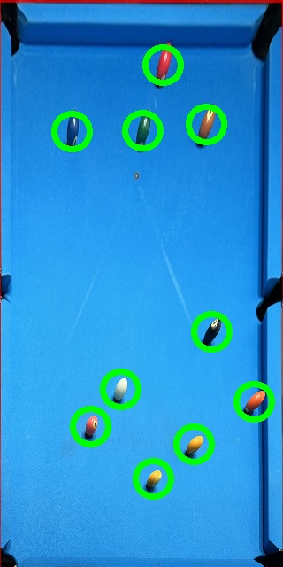

# Background on pool

In pool, a general goal is to use the cue ball (white ball) to pot an object ball (numbered ball) into a pocket. In many games, a critical part is to not only pot the object ball but to also leave the cue ball in a good position for the next shot (see https://en.wikipedia.org/wiki/Nine-ball). This is called *playing position* and can be achieved by varying the three scalars below:

speed, horizontal strike position (x-strike), vertical strike position (y-strike)

# Goal of this project

The goal is to use machine learning to approximate the following function

$$f\colon\text{position of the balls (cue ball + object balls)}\rightarrow \text{speed, x-strike, y-strike}$$

which outputs the best way to hit the cue ball to play position given the current layout of the balls. As most experienced pool players know, pool is a game of milimeters meaning the slightest of change is the layout of the balls can have a big impact on how you would play. Hence the ideal function $f$ would be very complex, expecially if there are many object balls.

We will rely on an open source pool simulator (https://ekiefl.github.io/projects/pooltool/) developed by Evan Kiefl.

Please see the demo.ipynb notebook for an illustration of the AI from a picture to the actual execution of the shot.

# Detecting ball locations from a picture

Our first task is to determine the playing surface of the table. Since pool cloth usually have two common colors (green or blue), we use simple masking to find a large area where the color is constant. We will use the following image for demonstration purposes.

In order to detect edges, we first mask the image for colors close to that of the cloth (blue in this case). There are other blue objects in this image, but we will filter them out by only considering the region with the largest area. Then we apply a Hough transform which detects the edges of the playing region. The detected edges of the playing surface are shown using red lines here

In a separate process, the fine-tuned YOLO-V8 model detects balls on the table as shown here

Note it misclassifies a ball outside of the table although to a low confidence level. For our purposes this is okay since as long as the misclassified object is not on the playing surface, the object will not be considered after we do a transformation. In the last step we compute the holography which lays the playing region flat. The resulting coordinates of the balls are then given as output to be used for the pool AI.

